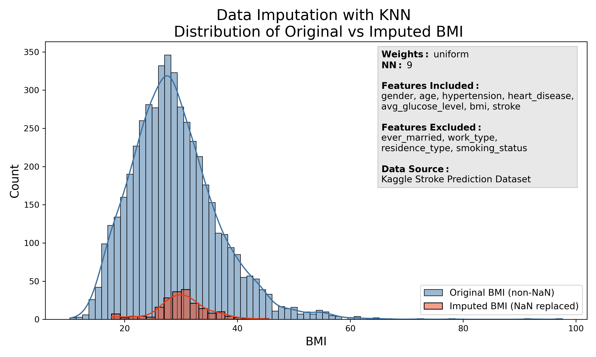
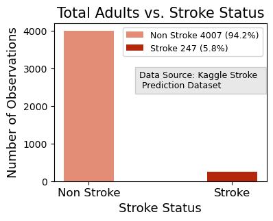
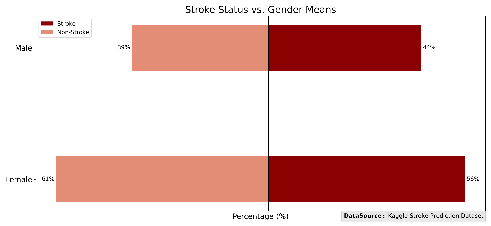
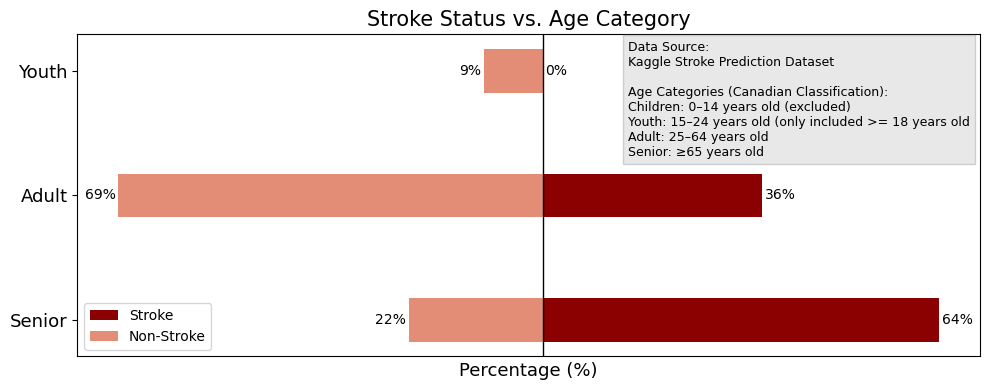
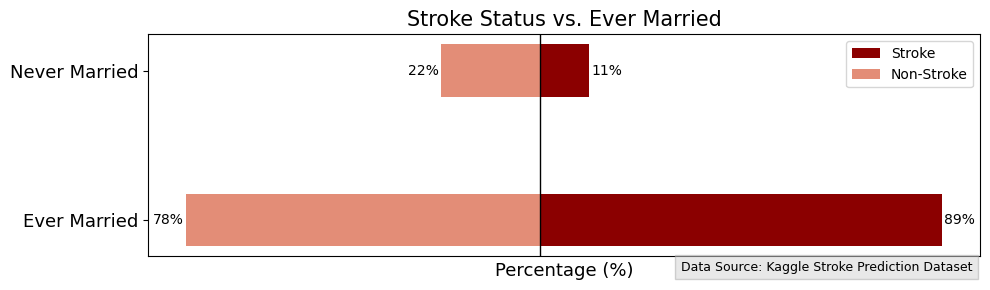
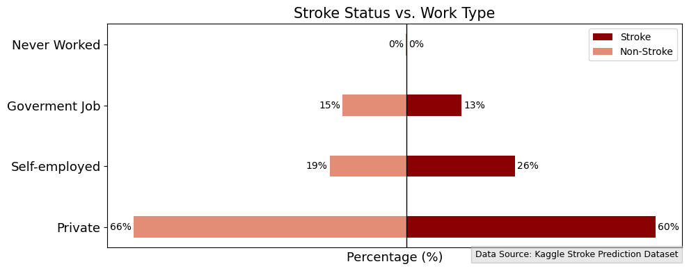
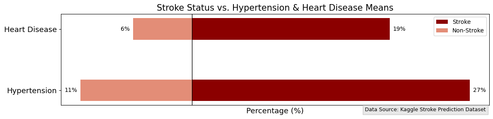
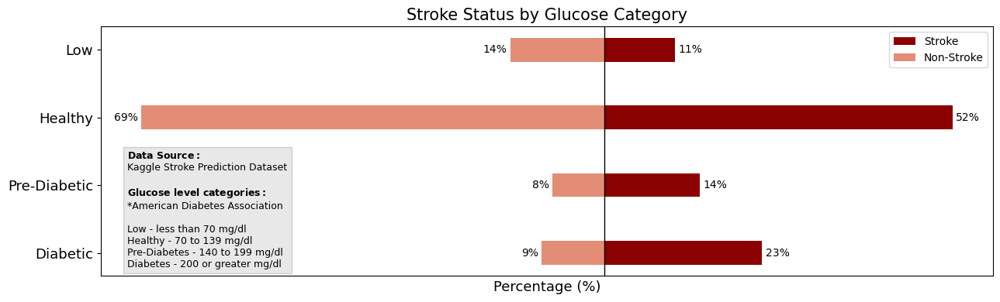
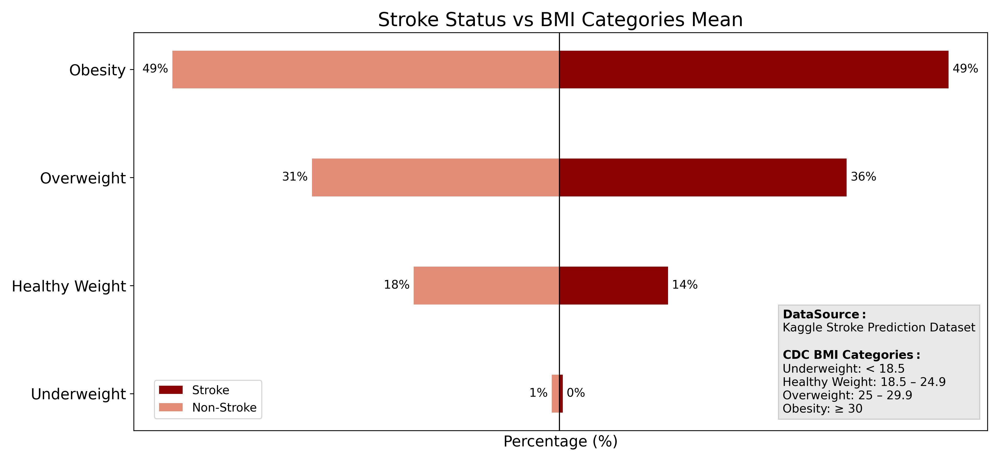
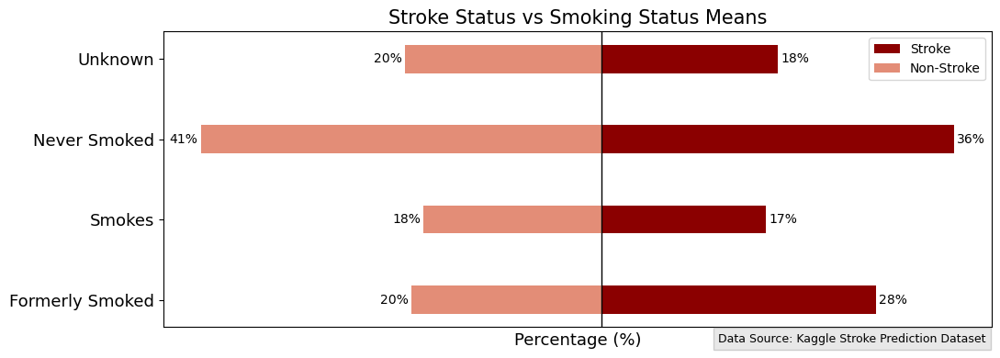

# Stroke Risk Stratification: Identifying vulnerable individuals through data visualization

Predicting the occurence of stroke in individuals using demographic and health-related factors.

## Type of project

- Data storytelling and visualization with a predictive model.
- Data Science Institute- Cohort 7- Team DS3 - Final Project

## Repository Structure

    ├── data
    ├──── processed
    ├──── raw
    ├── experiments
    ├── images
    ├── models
    ├── reports
    ├── src
    ├── README.md
    └── .gitignore

- Data: raw, processed and final data.
- Experiments: Experiments.
- Images: Final images.
- Models: Trained models or model predictions.
- Reports: Generated HTML, PDF etc. of the analysis report.
- src: Project source code.
- README: This file.
- .gitignore: Files to exclude from this folder.

## Team Members

- Joshua Okojie
- Lindsay Hudson
- Mariluz Lopez Zamora

## Chosen Dataset: Stroke Prediction Dataset

- URL: <https://www.kaggle.com/datasets/fedesoriano/stroke-prediction-dataset>

## Project Overview

- [Purpose and Overview](#purpose-and-overview)
- [Methodology](#methodology)
- [Data Analysis](#data-exploration)
- [Predictive Model](#predictive-model)
- [Technical Stack](#technical-stack)
- [Team Member´s Videos](#team-members-videos)
- [References](#references)

## Purpose and Overview

This project has as goal to analyze and visualize the stroke prediction dataset to obtain a target model of individuals most at risk of suffering from a stroke. The goal is to develop effective preventive measures and campaigns to reduce the prevalence of stroke.

### Business Problem

We are a group of data scientists concerned about the high mortality and disability associated with stroke. In Canada, it is the third leading cause of death and the tenth largest contributor to disability-adjusted life years (the number of years lost due to ill health, disability, or early death)(1). It impacts health system costs, the workforce, and society.

Our job is to characterize individuals at the highest risk of stroke based on demographic and risk factors. This profile will enable the identification of the target population that could benefit from health prevention campaigns, as well as marketing campaigns with industries that develop products associated with health, fitness, and healthy food.

We worked with the Stroke Prediction [Dataset](https://www.kaggle.com/datasets/fedesoriano/stroke-prediction-dataset), which is public through kaggle. It consists of 5.110 observations with 11 attributes between demographic and possible risk factors like health comorbidities and lifestyle information, including the variable ‘stroke’ which is 1 if the patient had a stroke or 0 if not.

After a preliminary analysis of the dataset we classified the attributes (columns) in four big groups defined as:

- Immutable demographic characteristics: Demographic characteristics that are not changeable like gender and age.
- Mutable demographic characteristics: Demographic characteristics that are potentially changeable like marital status, work and residence type.
- Immutable Risk: aspects related to the individual that could be related with major risk of stroke and are not alterable like chronic comorbidities: heart disease and hypertension.
- Mutable Risk Factors: aspects related to the individual lifestyle that could be related with major risk of stroke and are alterable like average glucose level, body mass index and smoking status.

Being focused on prevention, dividing the attributes into mutable and immutable categories allows for the identification of features that can be changed through clinical and lifestyle intervention.

#### Features description:

| Feature        | Type                     | Description                                                                                   |
| -------------- | ------------------------ | --------------------------------------------------------------------------------------------- |
| id             | Integer, unique          | Unique identifier for each patient                                                            |
| gender         | String, binary           | "Male", "Female", or "Other"                                                                  |
| age            | Integer                  | Age of the patient                                                                            |
| hypertension   | Integer, binary (0/1)    | 0 = patient does not have hypertension; 1 = patient has hypertension                          |
| heart_disease  | Integer, binary (0/1)    | 0 = patient does not have heart disease; 1 = patient has heart disease                        |
| ever_married   | String, binary           | "Yes" or "No"                                                                                 |
| work_type      | String, non-binary       | Patient’s type of work: "children", "Govt_job", "Never_worked", "Private", or "Self-employed" |
| residence      | String, binary           | "Urban" or "Rural"                                                                            |
| avg_glucose    | Float (2 decimal places) | Average glucose level in blood                                                                |
| bmi            | Float (1 decimal place)  | Body Mass Index                                                                               |
| smoking_status | String, non-binary       | "Formerly smoked", "Never smoked", "Smokes", or "Unknown"\*                                   |
| stroke         | Integer, binary (0/1)    | 1 = patient had a stroke; 0 = patient did not have a stroke                                   |

_Note: "Unknown" in smoking_status means that the information is unavailable for this patient._

## Methodology

### [Data Exploration](srs/data_processing.ipynb)

#### [Identified Risk and Unknown and Resolve Missing Values](reports/README_data_processing.md)

##### Missing Values

- A review of the dataset identified some 'N/A' values in the 'bmi' column, and 'unknowns' in the 'smoking_status' column (data unavailable for patient).
- After careful consideration and analysis, and taking into account the different types of data each column provides, we handled them as follows:

  - BMI missing values (NaN) represent 201 observations, which corresponds to 4% of the dataset. This is within the acceptable range for using imputation with minimal risk to the dataset. Furthermore, the data is considered Missing Not at Random (MNAR) because it depends on the respondents’ willingness to disclose their weight.

    However, the BMI column has a minimum value of 10.3 and a maximum value of 97.6, with a mean of 28.8. Because of the large gap between these values, we decided to handle the missing data in this column through imputation using KNN with a number of neighbours equal to 9.

    

  - The smoking_status value “Unknown” represents 1,544 observations, which corresponds to 30% of the dataset. In addition, this attribute only allows three answer options: never smoked, formerly smoked, and smokes.

    Since missing data greater than 10% can introduce bias into statistical analysis, and more advanced imputation methods are usually required for larger percentages of missing data, we decided not to use imputation in this case. Furthermore, the data is considered Missing Not at Random (MNAR) because it depends on the respondents’ willingness to disclose their smoking status.

    Therefore, missing data will be treated as its own category, with “Unknown” used as a fourth category.

##### Standardization

- A review of the dataset indentified numerous inconsistencies within the labels and values such as string capitalization, and float decimal length. These inconsistencies were standardized prior to analysis and are detailed below:

  - The Residence column title was capitalized while other column titles were not; this was corrected.
  - Some feature values such as work_type, smoking_status, ever_married, and residence were kept with the first letter capitalized, as in the original dataset.
  - The age column was left with its original number of decimal places because it includes observations of less than one year, which could be altered otherwise.
  - The float types (avg_glucose and bmi) were standardized in terms of the number of decimal places.

##### Lack of Data Context

- The Kaggle Stroke Prediction Dataset did not provide context regarding data collection methods. This posed challenges for data analysis, and interpretion.

  For example, it is unknown how data was collected for the average glucose level. There are various types of glucose level measurment tests such as the Oral Glucose Tolerance Test (OGTT) and the Fasting Plasma Glucose (FPG) test. The paramenters for designating blood sugar levels as healthy, pre-diabetic, and diabetic vary signifcantly between the test types. The number of individuals per glucose level category varied depending on the test type parameters. It is impossible to determine the true impacts of glucose level without the appropriate context around testing method. For the purpose of our project we chose to use the OGTT parameters as per the American Diabetes Association as it is the most commonly administered test type, however, this assumption may be incorrect.

  The graph below illustrates the differences between applying the OGTT and FPG parameters to the dataset.

  

##### Variation in Values

- The dataset contained multiple columns for ratio attribute types with unique float values. While the precision of these unique values may offer meaningful insight when used to build a model, the precision of these values was detrimental to creating meaningful visualizations (ex. X-axis with a hundred distinct but similar values). To address this issue, we consulted previously validated clinical parameters established by medical associations to determine appropriate parameters for creating categorical bins. These bins (categories) were used to create more meaningful visualizations. Additional details can be found in the subsequent section.

#### Identifying correlations:
 Preliminary visualization of data to understand patterns, correlations and data distribution

- After extract the observations with stroke we figured a big imbalances in the dataset, we only found: 249 obervations with stroke. It means only 4.9% of the observations and two of them was pediatric population.

- Adjustment for Age and Physiological Differences: After extensive analysis, it was decided to reduce confounding factors associated with age and physiological differences between adults (≥18 years old) and the pediatric population (<18 years old). For example, different tools and reference values are used to determine healthy weight and glucose levels in pediatric populations. Additionally, the incidence of pediatric stroke is estimated at approximately 1.2 to 13 cases per 100,000 children under 18 years old (2). In contrast, adults experience a much higher incidence, with nearly 151 cases per 100,000 individuals per year (3).

- The big difference between the BMI values, with min value 10.3 and max value 97.6, made difficult the visualization of the correlation Stroke vs. BMI. Further, pediatric population had a different interpretation of BMI that is based on percentiles and standard deviations, this affect the interpretation of this variable because pediatric observations could be misclassified as low weight. After exclude the pediatric population we used the BMI classification from the CDC (4):

  - Underweight: < 18.5
  - Healthy Weight: 18.5 > 25 
  - Overweight: 25 > 30
  - Obesity: ≥ 30 

    

- The big difference between average glucose level with min value in 55, and max value in 271, was an issue as well, after remove the pediatric population, we decide to use the American Diabetes Association classification (5):

  - Low glucose level: less tan 70 mg/dl
  - Healthy Value: 70 - 140 mg/dl 
  - Prediabetes or oral glucose intolerance: 141 - 199 mg/dl
  - Diabetes: ≥ 200 mg/dl: .

  

- It was used the canadian classification for age (6), excluding children categories and assuming the impact on the youth categories after exclude observations with less than 18 years old:

  - Children:  0 - 14 years old
  - Youth:  15 - 25 years old
  - Adult:  25 - 64 years old
  - Senior ≥ 65 years old

## Data Analysis

### Demographic Characterization of adult observations with and without stroke

- Immutable demographic characteristics:

  ***Gender:***

  
  - From the total observations, 39% of them was male and 61% was female.
  - From our 247 observations of stroke, 44% of them was male and 56% was female.

  ***Age:***
  

  

  - We could observed a increase of stroke incidence after 57 years old, with 60% of observations had 57 or more years old and 40% had less than 57 years old. And a second peak of incidence after 78 years old.

  

- Mutable demographic characteristics:

  ***Marital status:***

  

  - 89% of individuals with stroke were ever married, and 11% were never married. However, people are more likely to be married at older ages, and the likelihood of having a stroke also increases with age. Therefore, age could be a confounding factor in this case.

  ***Setting:***
    
 

  ***Type of work:***

    

- Immutable Risk:

  ***Comorbidities:***
    

    

    - Through visualization, we found that patients with stroke tend to have higher rates of hypertension and heart disease than patients without stroke.

- Mutable Risk Factors:

  ***Glucose average:***
    
    - According with the American Society of Diabetes classification, and in base of glucose average, 23% of the patients had an average in the diagnosis range of diabetes that was not reported in the dataset information or used as characteristic, also, 14% had an average of glucose in oral glucose intolerance and  52% have a normal value.

    

   - When we compare with patients without stroke, a few percentage  of them had glucose average in diabetic or oral glucose intolerance and they had more percentage in a healthy glucose value, this could sugest a protective factor there.

  ***Body Mass Index:***
  

   -  Using the BMI classification from CDC, when comparing patients with and without stroke observations, the visualization shows similar foundings in them.

  ***Stroke and smoke:***
    

    - When we compare the percentage of patients in the “never smoked” category, between those with and without stroke, it appears to be a protective factor. On the other hand, being a former smoker seems to be a risk factor.

### [Statistical Analysis](srs/statistical_analysis.ipynb)

Selecting relevant features and observations to include in the model, while removing variables that could act as confounding factors to ensure model accuracy.

#### Statistical Analyst of Features

A chi-square test of independence was conducted to determine which features were significant among stroke patients. To employ this test, ratio type features were converetd to categorical using previously validated clinical parameters for age, bmi, and glucose level groups. The T-test was applied to continuous numerical variables and the Chi Square was applied on categorical variables . These results helped guide decisions on which features to include in building our predictive stroke model.

The features of age, smoking status, glucose level, hypertension, heart disease, work type, and BMI were all significant (p-value , <0.05) and were included in training the model. The features of gender, residence type, and marriage status were excluded from training the model. Gender (p-value > 0.05) and residence type (p-value > 0.05) were not significant and thus excluded from the model based on their lack of impact. Marriage status was significant (p-value < 0.05) however, due to the significance of age among stroke patients, and the influence of age on marriage status (ie. older individuals are more likely to be married). There were concerns that including marital status could lead to an overestimation of its effect, since age acts as a confounding factor for this variable. After a statistical analysis, adjusting for maritial status by age the difference was not significant (p-value > 0.05), and the first result was explained due to the significance of age among stroke patients, the decision was made to exclude it from the model.

##### [Final selection of features for model](reports/README_statistical_analyst.md)

- Exclude Features: Not significant (p-Value >0.5)

  - Gender Type
  - Marriage Status (Adjusted by age)
  - Residence Type

- Included Features: Significant (p-Value <0.5)
  - Smoking Status
  - Age
  - Glucose Level
  - Hypertension
  - Heart Disease
  - Work Type
  - BMI

## Predictive Model

### Model Purpose

- The purpose of the developed model was to identify individuals aged 18 or older who are most at risk of developing stroke, based on the selected features of smoking status, age, glucose level, hypertension, heart disease, work type, and bmi. These individuals could then receieve preventative interventions targeting mutuable risk features.

### Building the Model

- All individuals under the age of 18 were removed from the dataset.
- Following the removal of child and youth patients, the stroke positive group consisted of 247 patients.
- A random sample of 247 patients from the stroke negative group was selected.
- The stroke positive and negative patient groups were then combined for a total dataset of 494 patients with a 50/50 split.
- The categorical features of smoking status, work type, hypertension, and heart disease were one-hot encoded, while the features of age, glucose level, and bmi were used in their ratio state.

- A simple logistical regression model with 10-fold cross validation (random state value of 42) was trained and tested on the features.

- Multiple models were experimented with, however model 3 was determined to be the highest performing version.

### Model Performance

-On average the model 3 achieves an F1 score of 0.75, but depending on the fold it's confidene interval ranges between 0.633 and 0.867.

Recall is consistently around 0.80, meaning the model captures most true positives.

Precision is lower at 0.71, which suggests the model returns some false positives.

The F1 score is about 0.75, which is relatively balanced but skews towards recall. It does a good job of catching stroke patients, but also flags non-stroke patients approximately 30% of the time. False psoitives are more desirable in this instance, as missing a possible stroke case is far more harmful than reccomending healthy lifestyle changes to patients that are not at risk. However, the score still has much room for improvement, and this level of false positives would not be acceptable for other medical conditions which require more invasive interventions.

Accuracy is around 0.74 which is fairly good. The accuracy of the model is high enough for it to be employed as a possible screening tool, but not precise enough for diagnosis purposes. This is acceptable for our project in which screening and early warning is the ultimate goal.

In healthcare we believe it is critical to be transparent regarding range uncertainty. Clinical stakeholders need to see beyond average score when making medical decisions. This transparency will help us build trust with stakeholders.

### Model Conclusion and Next Steps

- Our model could serve as a clincial screening tool to idenitfy adults at risk for stroke and drive low-risk lifestyle change reccomendations such as smoking cessation, weight loss and glucose level managment through dietary and exercise changes, and therapy or activities for stress management. The model should not be used for reccomending moderate to high-risk interventions such as medications. It's level of false positives could result in harm if medications are prescribed to individuals who do not need them.

- Our next steps in refining our model would involve the following:

  Obtaining a larger stroke population dataset and context surrounding data collection methods.

  Identifying possible additional relevant features such as a stress rating score, cholesterol levels etc.

  Leveraging SHAP analysis to understand what features are driving predictions.

  Auditing the model for potential biases, and consider tracking performance across various demographic segmentations. This is crucial to ensure certain groups are not underserved by our model.

  Validating the model on additional external stroke datasets to confirm it performs consistently and reliably.

## Project Scope

This project focuses on conducting a classification analysis using demographic and health-related data from individuals aged 18 to 82 years. The goal is to identify key factors that predict which individuals are most at risk of developing stroke.

To ensure the reliability of the analysis, we will apply data splitting techniques and evaluate performance metrics.

In addition, the project will provide insights and recommendations to highlight which groups of individuals may benefit most from prevention campaigns and healthy lifestyle strategies based on the findings.

### Stakeholders

- Health Providers

  - Develop preventive strategies that can reduce costs for the healthcare system.

  - Use insights to improve patient care and early intervention.

- Insurance Companies

  - Life insurance providers interested in identifying insurable individuals.

  - Develop preventive strategies for policyholders to reduce long‑term risk and claims.

- Marketing Segmentation

  - Preventive product industries: companies that design products to reduce stroke risk.

  - Rehabilitation and disability support industries: organizations that provide products or services to help patients living with stroke‑related disabilities.

  - Wellbeing and fitness industries: businesses promoting exercise, lifestyle improvement, and overall health.

  - Healthy food industries: companies focused on nutrition and dietary products that support stroke prevention.

## Technical stack

### Programming Language

- Python

### Libraries Used
- NumPy: matrix operations, numerical computations
- Pandas: data analysis, handling datasets
- SciPy: statistical tests and scientific computations
- Statsmodels: statistical modeling and regression analysis
- Matplotlib: creating graphs and plots
-Seaborn: enhancing matplotlib plots, data visualization
- Plotly: interactive graphs and plots
- scikit-learn (SKLearn): machine learning, preprocessing, classification, pipelines, model evaluation
- PIL (Pillow): image processing
- Requests: HTTP requests, downloading data from the web

## Team member's videos

- Joshua Okojie
- Lindsay Hudson: https://drive.google.com/file/d/1u1E-IqdGAs9LuM7lpb5aCkh5Q2tjoLI6/view?usp=sharing
- Mariluz Lopez Zamora

## References

- (1)<https://www.canada.ca/en/public-health/services/publications/diseases-conditions/stroke-canada-fact-sheet.html>
- (2) <https://pmc.ncbi.nlm.nih.gov/articles/PMC9856134/>
- (3) <https://pmc.ncbi.nlm.nih.gov/articles/PMC11786524/>
- (4) <https://www.cdc.gov/bmi/adult-calculator/bmi-categories.html>
- (5) <https://diabetes.org/about-diabetes/diagnosis>
- (6) <https://www.statcan.gc.ca/en/concepts/definitions/age2>
- Dong, Y., & Peng, C. Y. J. (2013). Principled missing data methods for researchers. SpringerPlus, 2(1), 222. https://doi.org/10.1186/2193-1801-2-222
- Junaid, K. P., Kiran, T., Gupta, M., Kishore, K., & Siwatch, S. (2025). How much missing data is too much to impute for longitudinal health indicators? A preliminary guideline for the choice of the extent of missing proportion to impute with multiple imputation by chained equations. Population Health Metrics, 23, Article 2. https://doi.org/10.1186/s12963-025-00364-2

-  <https://doi.org/10.1186/s12963-025-00364-2>
  <https://python-graph-gallery.com/>
